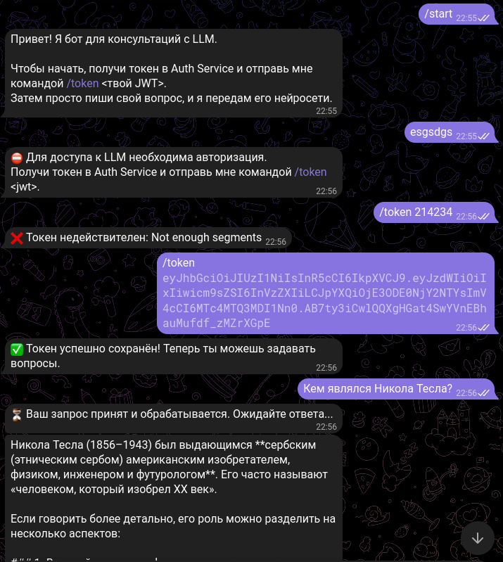
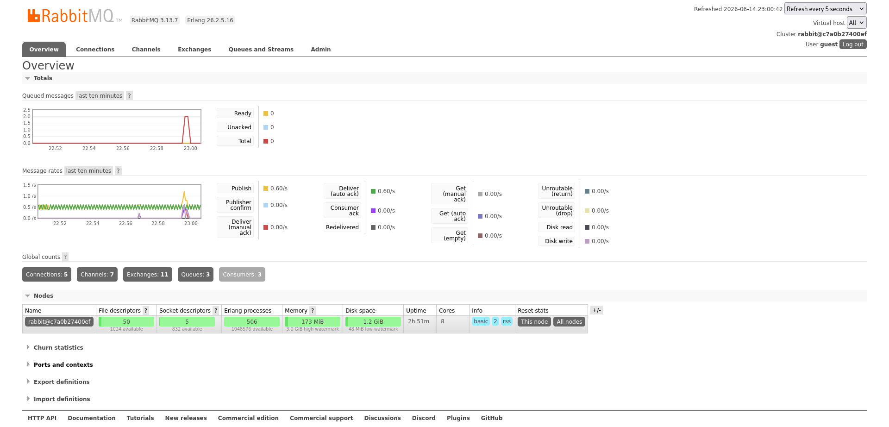
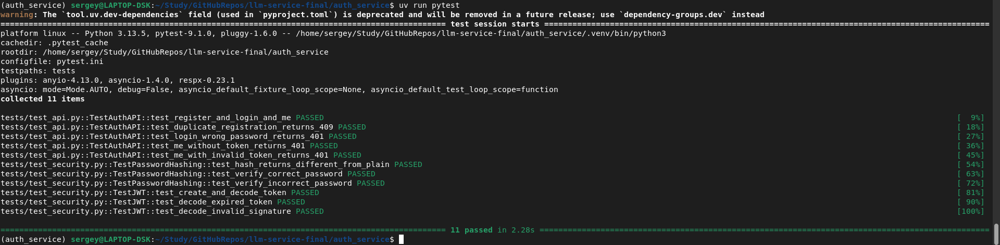
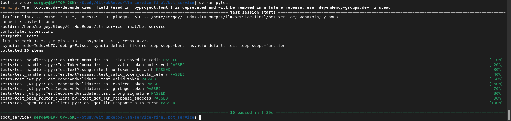

# Двухсервисная система LLM-консультаций

В рамках проекта разрабатывается распределённая система, состоящая из двух логически и технически независимых сервисов, каждый из которых выполняет строго определённую роль. Архитектура построена по принципу разделения ответственности: один сервис отвечает исключительно за аутентификацию и выпуск токенов, второй — за предоставление функциональности LLM-консультаций через Telegram-бота. Такое разделение позволяет изолировать чувствительную логику работы с пользователями и учетными данными от прикладного сервиса, работающего с внешними пользователями и внешними API.

## Требования к установке

* **Python** от 3.11;
* **uv** от 0.11;
* **Celery** от 5.4.0;
* **Redis** от 5.0.0.

# Auth Service

Auth Service предоставляет веб-API и Swagger по адресу `http://0.0.0.0:8000/docs#/`. В этом сервисе реализуются регистрация пользователя, вход (логин) и выдача JWT. Сервис хранит пользователей в базе (например SQLite или Postgres), хранит пароль только в виде хеша и формирует JWT с полями sub (id пользователя), role и временем жизни. Этот сервис является единственным местом, где выполняется “выпуск” токенов и управление пользователями.

---

## Архитектура сервиса

```
auth_service
├── app
│   ├── api
│   │   ├── deps.py             # Завистимости FastAPI
│   │   ├── router.py           # Подключение роутеров
│   │   └── routes_auth.py      # Эндпоинты Auth Service
│   ├── core
│   │   ├── config.py           # Pydantic-settings
│   │   ├── exceptions.py       # Исключения
│   │   └── security.py         # Функции безопасности
│   ├── db
│   │   ├── base.py             # Базовый класс SQLAlchemy
│   │   ├── models.py           # ORM-модели Auth Service
│   │   └── session.py          # Асинхронный engine SQLAlchemy 
│   ├── repositories
│   │   └── users.py            # Доступ к пользователям
│   ├── schemas
│   │   ├── auth.py             # Pydantic-схемы для регистрации
│   │   └── user.py             # Публичное представление пользователя
│   └── usecases
│       └── auth.py             # Бизнес-логика Auth Service
├── main.py                     # Точка входа сервиса
├── pyproject.toml              # Зависимости сервиса (uv)
├── pytest.ini                  # Настройка тестов
└── tests
    ├── conftest.py             # Фикстуры для тестов
    ├── test_api.py             # Интеграционные тесты (с TestClient)
    └── test_security.py        # Модульные тесты (без БД и HTTP)

```

---

## Сценарий работы

Перейдите по ссылке `http://0.0.0.0:8000/docs#/`, вас встретит Swagger UI.


---

Для начала нужно зарегистрироваться в сервисе. Нажмите на `POST /auth/register` и впишите ваш email и пароль.


---

Теперь нажмите `Execute` и вы будете зарегистрированы.


---

После этого необходимо войти в систему, чтобы получить JWT токен. Нажмите на `POST /auth/login` и введите в поле username и password ваш email и пароль.


---

Сервис выдаст вам ваш токен. Скопируйте его куда-либо.


---

Чтобы проверить данные вашего профиля, авторизуйтесь в системе, нажав `Authorize` сверху интерфейса и вставьте JWT токен.


---

Теперь выполните `GET /auth/me` и сервис выдаст вашу информацию.


---

# Bot Service

Bot Service содержит Telegram-бота на aiogram. Основная логика: бот принимает сообщения пользователя, проверяет наличие JWT и валидирует его. Если токен валиден, бот отправляет запрос к LLM и возвращает ответ. Если токен отсутствует или неверный, бот отказывает в доступе и просит пользователя авторизоваться через Auth Service. Валидация JWT выполняется на стороне Bot Service без обращения к базе данных Auth Service.

Чтобы бот не зависал на долгих ответах LLM и чтобы система выдерживала нагрузку, запросы к LLM отправляются не напрямую, а через очередь. Bot Service выступает как “producer”: отправляет задачу в RabbitMQ, после чего Celery worker забирает задачу, выполняет запрос к LLM, сохраняет результат и возвращает ответ пользователю. RabbitMQ используется как брокер задач Celery.

Роли компонентов:
*    **aiogram** bot принимает входящие сообщения
*    **Bot Service** публикует задачу “LLM запрос” в RabbitMQ
*    **Celery** worker обрабатывает задачу, вызывает LLM и формирует ответ
*    **Redis** используется как кэш
*    **aiogram** отправляет пользователю итоговый ответ

---

## Архитектура сервиса

```
bot_service
├── app
│   ├── bot
│   │   ├── dispatcher.py           # Сборка бота и подключение роутеров
│   │   ├── handlers.py             # Логика общения с пользователем
│   │   └── polling.py              # Запуск бота
│   ├── core
│   │   ├── config.py               # Настройки сервиса
│   │   └── jwt.py                  # Проверка токена
│   ├── infra
│   │   ├── celery_app.py           # Создание объекта celery_app
│   │   └── redis.py                # Точка получения Redis клиента
│   ├── services
│   │   └── openrouter_client.py    # Обращение к OpenRouter через httpx
│   └── tasks
│       └── llm_tasks.py            # Celery задача llm_request
├── main.py                         # Точка входа FastAPI
├── pyproject.toml                  # Зависимости сервиса (uv)
├── pytest.ini                      # Настройка тестов
└── tests
    ├── conftest.py                 # Фикстуры для тестов
    ├── test_handlers.py            # Мок тест обработчиков
    ├── test_jwt.py                 # Модульный тест JWT
    └── test_open_router_client.py  # Интеграционный тест клиента
```

---

## Сценарий работы

Добавьте бота в Telegram: `@M2551004_LLMServiceBot`.

---

Чтобы начать пользоваться - напишите `/start`.

После этого бот предложит отправить вам ваш JWT токен. Без этого ответ на запросы невозможен. Напишите `/token <JWT токен>`.

После этого можно отправить любой вопрос и получить ответ от LLM.

**Пример**



---

# Проверка работы сервиса в RabbitMQ

Наличие сообщений в очередях и активных consumers - признак корректной реализации асинхронной архитектуры проекта.



---

# Результаты unit тестов




