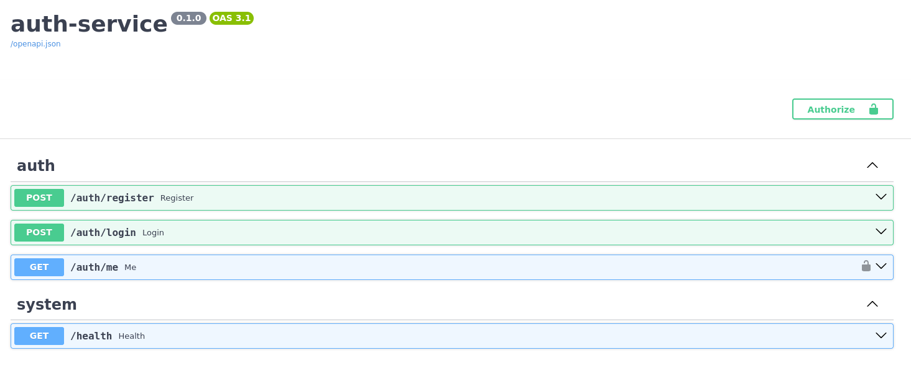
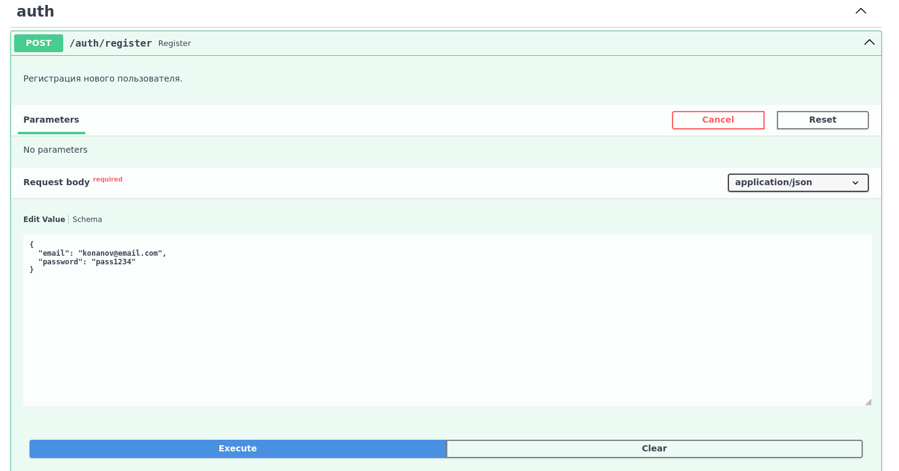
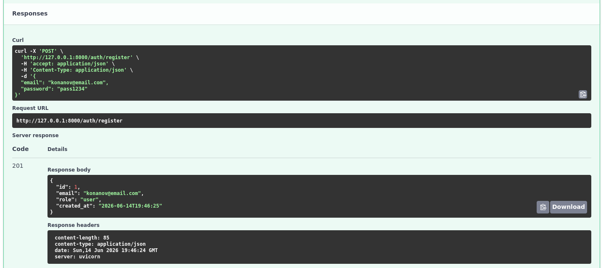
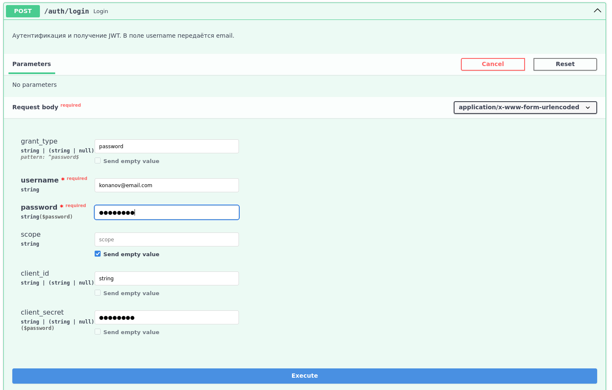
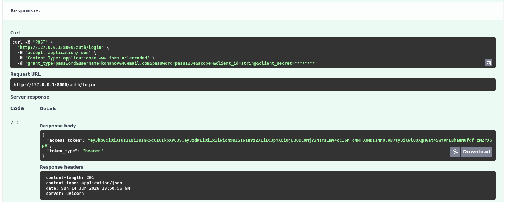
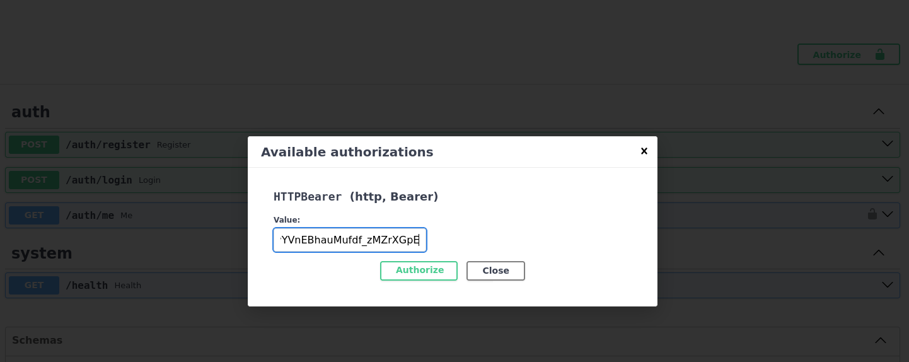
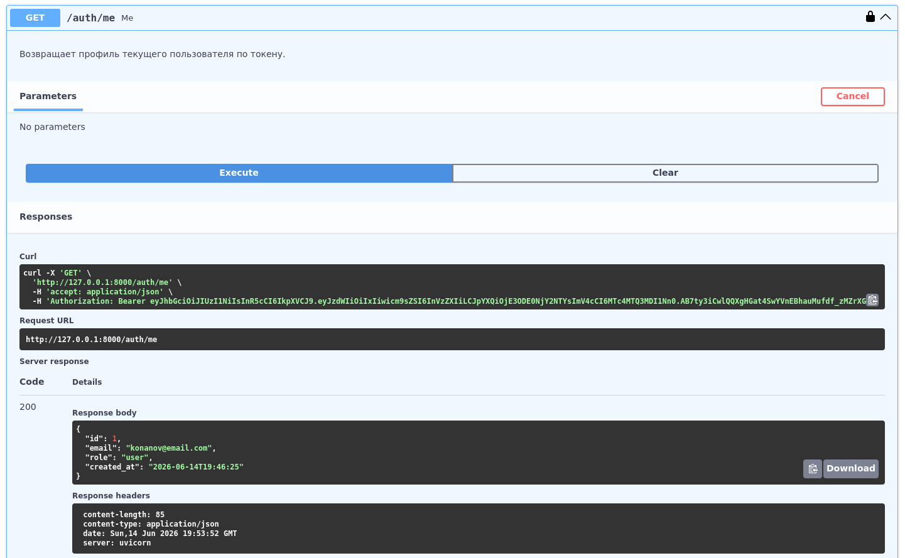

Установка uv 

 pip install uv
  

Инициализация проекта

 uv init 
  

Создание виртуального окружения

 uv venv
  

Активировать виртуальное окружение

 source .venv/bin/activate # MacOS/Linux
 .venv\Scripts\activate.bat # Windows


Установить зависимости

  uv pip install -r <(uv pip compile pyproject.toml)


# Двухсервисная система LLM-консультаций

В рамках проекта разрабатывается распределённая система, состоящая из двух логически и технически независимых сервисов, каждый из которых выполняет строго определённую роль. Архитектура построена по принципу разделения ответственности: один сервис отвечает исключительно за аутентификацию и выпуск токенов, второй — за предоставление функциональности LLM-консультаций через Telegram-бота. Такое разделение позволяет изолировать чувствительную логику работы с пользователями и учетными данными от прикладного сервиса, работающего с внешними пользователями и внешними API.

## Требования к установке

* **Python** от 3.11;
* **uv** от 0.11;
* **Celery** от 5.4.0;
* **Redis** от 5.0.0.

# Auth Service

Auth Service предоставляет веб-API и Swagger по адресу `http://0.0.0.0:8000/docs#/`. В этом сервисе реализуются регистрация пользователя, вход (логин) и выдача JWT. Сервис хранит пользователей в базе (например SQLite или Postgres), хранит пароль только в виде хеша и формирует JWT с полями sub (id пользователя), role и временем жизни. Этот сервис является единственным местом, где выполняется “выпуск” токенов и управление пользователями.

---

## Архитектура сервиса

```
auth_service
├── app
│   ├── api
│   │   ├── deps.py
│   │   ├── router.py
│   │   └── routes_auth.py
│   ├── core
│   │   ├── config.py
│   │   ├── exceptions.py
│   │   └── security.py
│   ├── db
│   │   ├── base.py
│   │   ├── models.py
│   │   └── session.py
│   ├── repositories
│   │   └── users.py
│   ├── schemas
│   │   ├── auth.py
│   │   └── user.py
│   └── usecases
│       ├── auth.py
├── main.py
├── pyproject.toml
├── pytest.ini
└── tests
    ├── conftest.py
    ├── test_api.py
    └── test_security.py

```

---

## Сценарий работы

Перейдите по ссылке `http://0.0.0.0:8000/docs#/`, вас встретит Swagger UI.



---

Для начала нужно зарегистрироваться в сервисе. Нажмите на `POST /auth/register` и впишите ваш email и пароль.



---

Теперь нажмите `Execute` и вы будете зарегистрированы.



---

После этого необходимо войти в систему, чтобы получить JWT токен. Нажмите на `POST /auth/login` и введите в поле username и password ваш email и пароль.



---

Сервис выдаст вам ваш токен. Скопируйте его куда-либо.



---

Чтобы проверить данные вашего профиля, авторизуйтесь в системе, нажав `Authorize` сверху интерфейса и вставьте JWT токен.



---

Теперь выполните `GET /auth/me` и сервис выдаст вашу информацию.



---

# Bot Service

